# hackathon_apr_2026

## Local Setup

This project uses `uv` and is pinned to Python `3.14`.

### Prerequisites

- Install Python 3.14
- Install `uv`: https://docs.astral.sh/uv/getting-started/installation/
- Have access to a Neo4j instance with challenge data loaded

### 1. Clone and enter the project

```bash
git clone <your-repo-url>
cd hackathon_apr_2026
```

### 2. Create environment variables

Create a `.env` file in the project root:

```dotenv
NEO4J_URI=bolt://localhost:7687
NEO4J_USERNAME=neo4j
NEO4J_PASSWORD=your_password
NEO4J_DATABASE=neo4j
```

### 3. Sync dependencies

```bash
make sync
```

This runs `uv sync` and installs runtime + dev dependencies from `pyproject.toml`.

### 4. Run the dashboard

```bash
make run
```

This starts Streamlit and serves the app from `app.py`.

### 5. Useful development commands

```bash
make help
make lint
make format
make test
make lock
make clean
```

### Optional: Export requirements.txt

If you need a pip-style requirements file:

```bash
make export-requirements
```

### Troubleshooting

- If `make sync` fails on Python version, confirm `python3.14` is installed and available.
- If app startup fails with Neo4j auth/connection errors, verify values in `.env`.
- If there are no results in charts, ensure your Neo4j database has loaded nodes and relationships.
- If `make neo4j-up` fails with `tls: bad record MAC` on macOS, run `make neo4j-up NEO4J_PLATFORM=linux/amd64`.

## Run Neo4j in Docker

### 1. Prepare local Neo4j folders

```bash
make neo4j-prepare
```

### 2. Start Neo4j with APOC enabled

```bash
make neo4j-up
```

Neo4j Browser: http://localhost:7474

Bolt URI for app config: `bolt://localhost:7687`

### 3. Update `.env` values

Use these values (or your own password if changed):

```dotenv
NEO4J_URI=bolt://localhost:7687
NEO4J_USERNAME=neo4j
NEO4J_PASSWORD=password
NEO4J_DATABASE=neo4j
```

### 4. Check the database is reachable

```bash
make neo4j-status
```

## Load Challenge Data into Neo4j

### Option A: Load from reusable script (recommended)

```bash
make neo4j-load
```

### Option B: Load manually in Neo4j Browser

Open Neo4j Browser at http://localhost:7474 and run the same statements from `queries/load-data.cypher`.

### Verify data loaded

```cypher
MATCH (e:Employee) RETURN count(e) AS employees;
MATCH (t:Team) RETURN count(t) AS teams;
MATCH (tk:Ticket) RETURN count(tk) AS tickets;
MATCH (p:Project) RETURN count(p) AS projects;
```

After this, start the app:

```bash
make run
```

### Stop and restart Docker Neo4j

```bash
make neo4j-stop
make neo4j-start
```

### Additional Neo4j make commands

```bash
make neo4j-shell
make neo4j-logs
make neo4j-down
```

## One-command bootstrap

Use this to set up everything needed for local development in one go:

```bash
make dev-up
```

This will:

- run `make sync`
- run `make neo4j-up`
- run `make neo4j-load`

Then start the app with:

```bash
make run
```

Based on https://github.com/Version1/ai-engineering-lab-hackathon-london-2026#

# Team HomeOffice A

# Participants

- Andrew Darnell
- Meenakshi Panchanadhen (Meens)
- Baharak Askarikeya
- Ezhil Suresh Chockalingham

# Key Questions a Director Wants Answered

1. People & Capacity
   Who's available right now vs. on leave, secondment, or long-term sick?
   Which teams are under-resourced relative to their workload?
   Where are my single points of failure (one person holds all the knowledge)?
   What's my vacancy/attrition picture — am I about to lose capacity?
   How much of my workforce is permanent vs. contingent/contractor?
2. Workload & Delivery
   What's the current demand on each team (open tickets, active projects, pending requests)?
   Are any teams consistently over-capacity while others have slack?
   What's the backlog trend — growing, stable, or shrinking?
   Which commitments are at risk of missing deadlines?
   How long does it take to fulfil a typical request (e.g. IT ticket, procurement, finance query)?
3. Skills & Development
   Do I have the right skills mix for upcoming priorities (e.g. cloud migration, new finance system)?
   Who's in development roles / apprenticeships and when do they complete?
   Where are critical skill gaps if someone leaves?
4. Cost & Efficiency
   What's my staff cost per team, and how does it compare to output?
   Where am I spending on overtime or contractors to plug gaps?
   Are there tasks being done manually that could be automated?
5. Risk & Compliance
   Are mandatory training / security clearances up to date?
   Which teams have the highest absence rates?
   Are any teams non-compliant with working-time or HR policies?
   Decisions This Data Enables
   Decision Without data With data
   Rebalance staff across teams Gut feel / loudest voice Evidence-based reallocation by demand
   Approve a new post vs. redistribute Default to recruitment Can show if redistribution is viable
   Prioritise projects Political pressure Capacity-aware sequencing
   Intervene on delivery risk Find out when it's too late Early warning from backlog/velocity trends
   Business case for tooling/automation Anecdotal Quantified time-spent data
   Succession planning Reactive Proactive, based on skill/knowledge maps

Respond to senior leadership asks "I'll get back to you" Real-time dashboard answers
How This Maps to Your Org Structure

# Observations on test data

Looking at your org-chart, you have 6 teams under one directorate with 25 people. Some practical observations:
Teams range from 3 to 6 people — a single absence in HR Business Partnering (3 people) has a much bigger proportional impact than in IT Service Desk (6 people). The tool should surface this fragility.
The director (EMP-0001) is also the Digital Services team lead — that dual-hat role means their availability is split. Tracking allocation across roles matters.
IT Service Desk likely has ticket-based demand (measurable), while Commercial and HR may have longer-cycle work. The tool needs to handle both transactional and project-based workload models.


## Dashboard Screenshots

### 📊 Overview

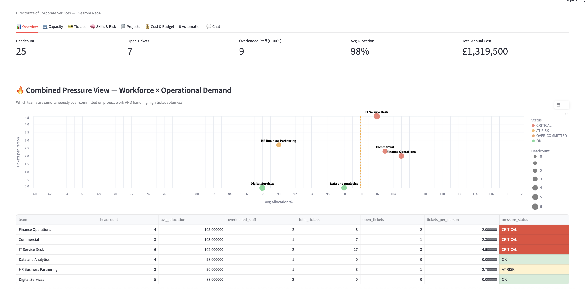
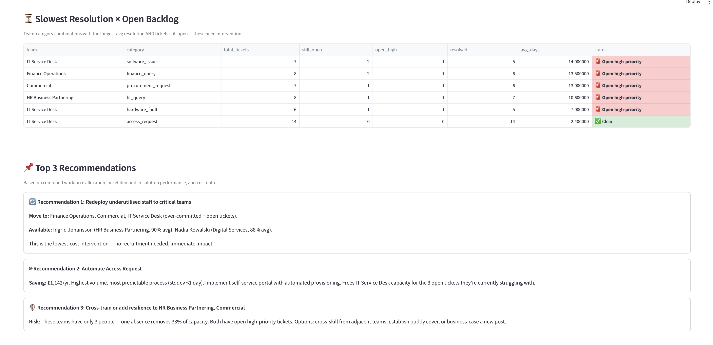
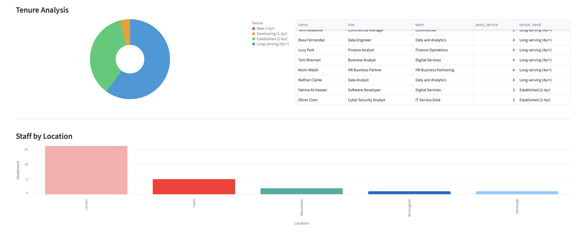

### 👥 Capacity

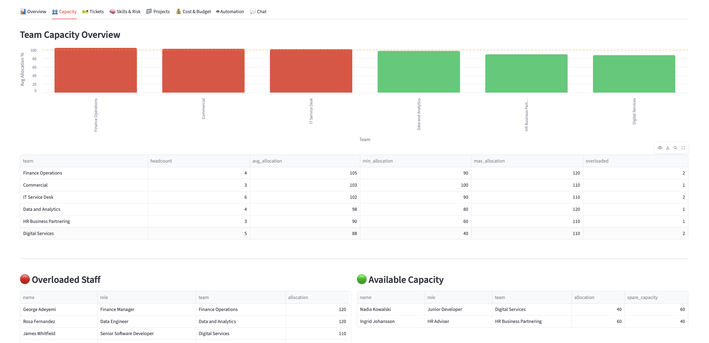
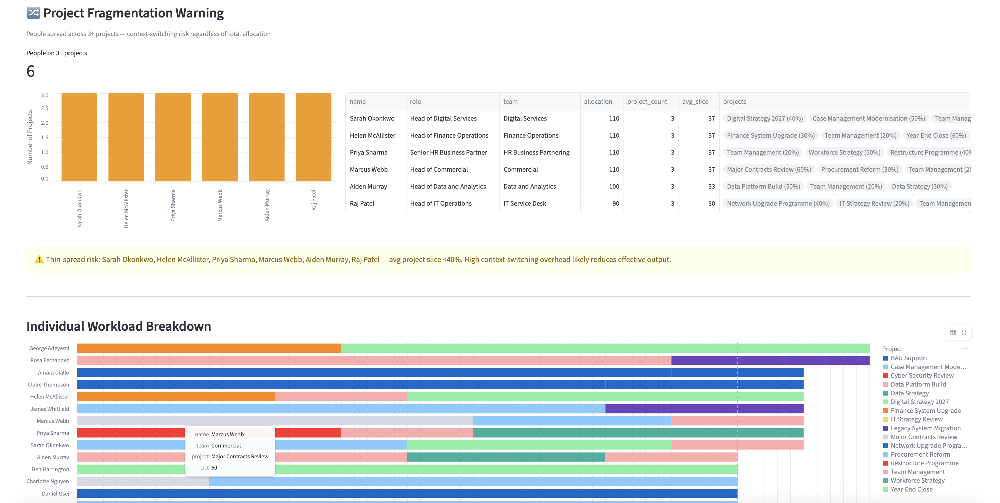

### 🎫 Tickets

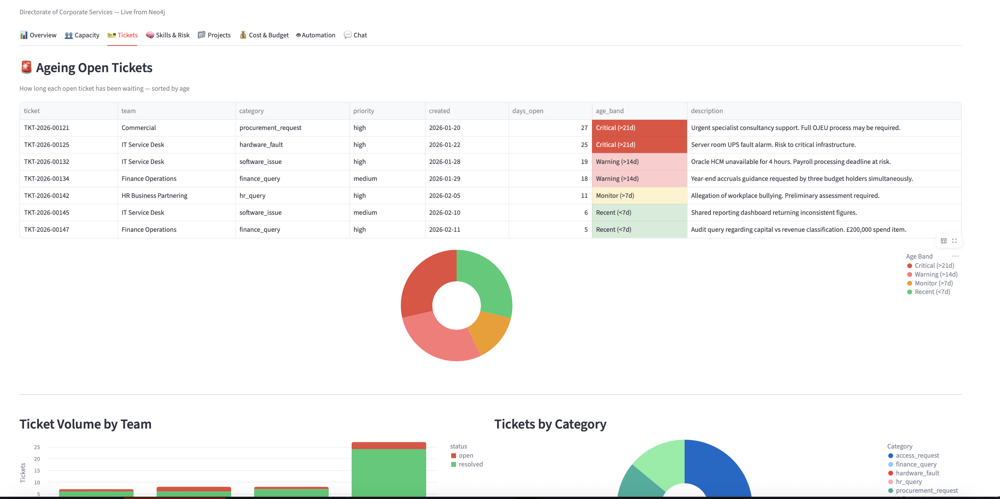
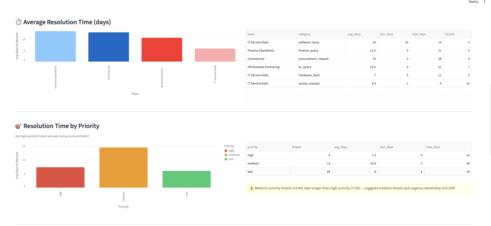
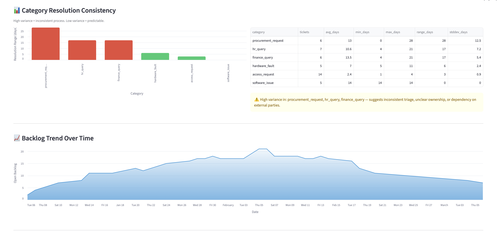
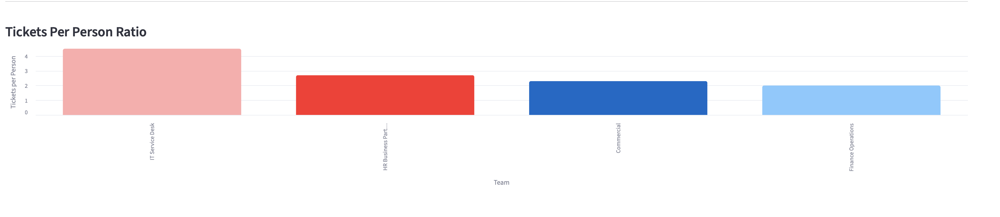

### 🧠 Skills & Risk

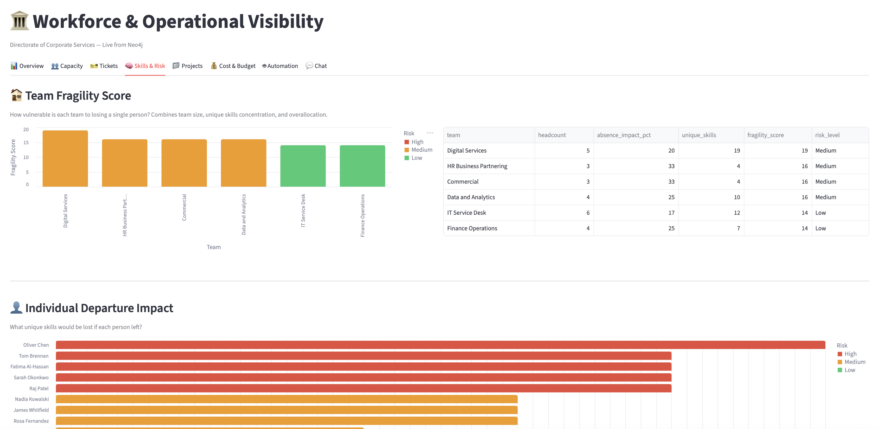

### 📁 Projects

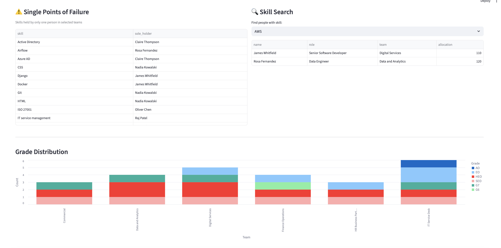
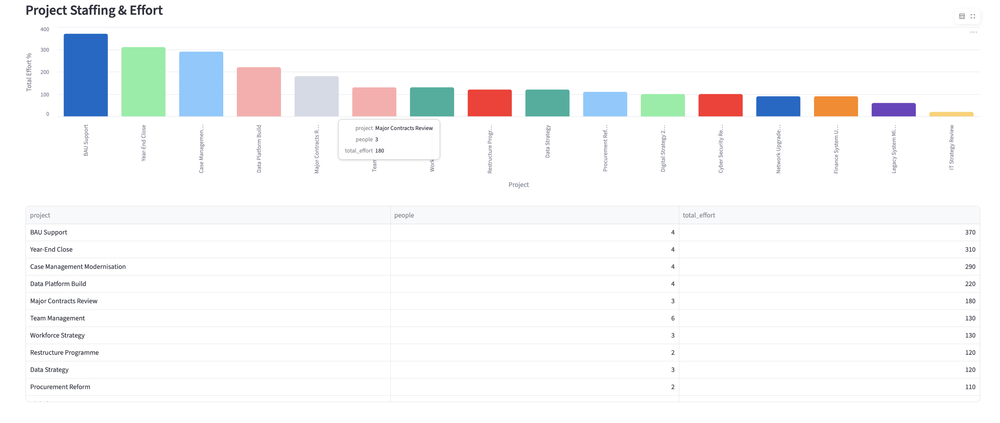

### 💰 Cost & Budget

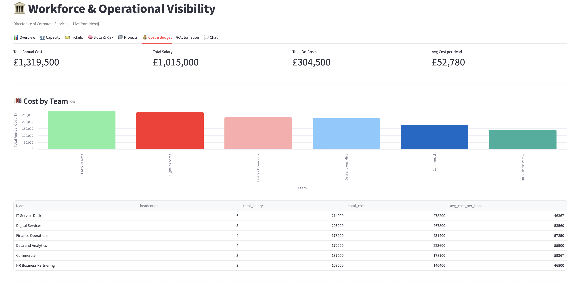
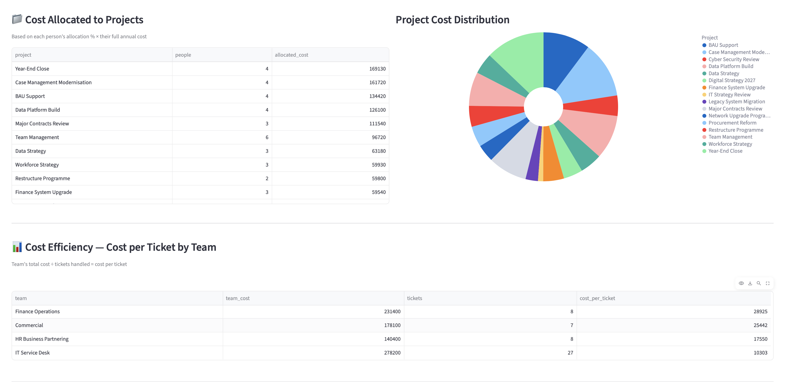
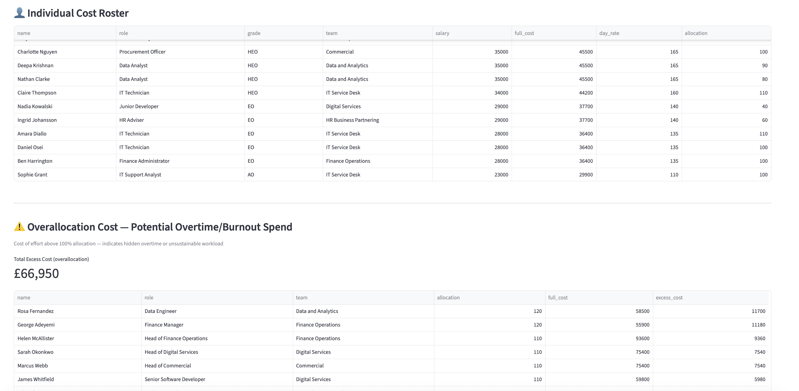

### 🤖 Automation

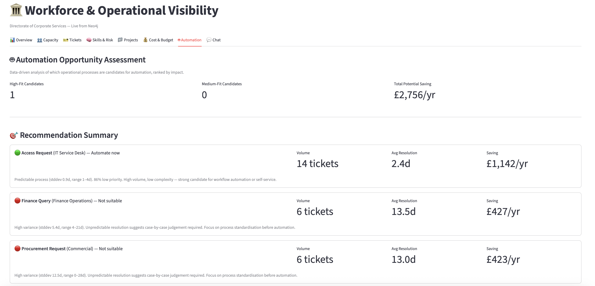
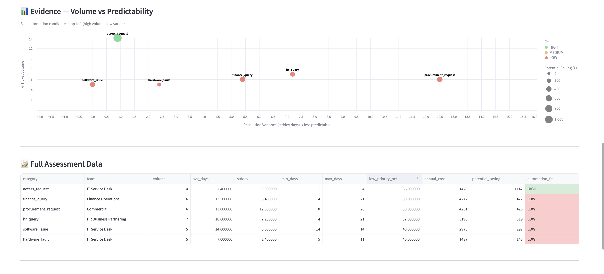
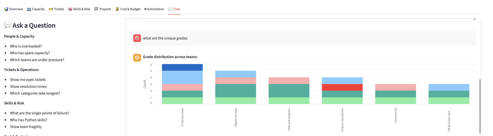

### 💬 Chat Interface

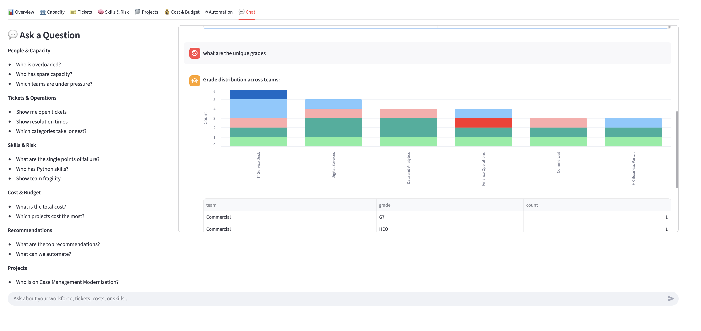
